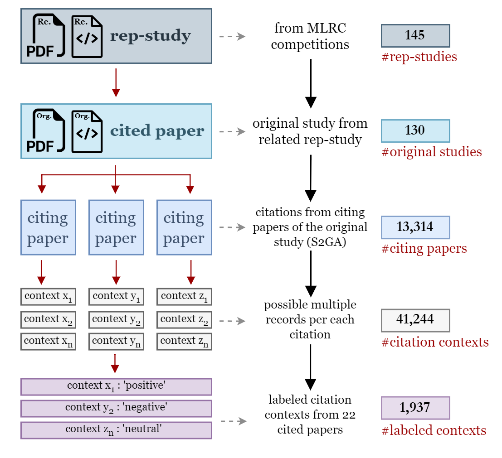

# Citation Contexts for AI Reproducibility [](https://doi.org/10.5281/zenodo.10895748)
This repository is for the proof of concept project for identifying the correlation between citation context of citing papers and the reproducibility of cited paper (original paper) within the field  of Artificial Intelligence. The repository contains the code and the data to reproduce results for the work titled: <b>"Can citations tell us about a paper’s reproducibility? A
case study of machine learning papers.</b> The project requires
Python GPU-based processing capabilities, TensorFlow, Keras and
PyTorch frameworks." 

## Folder structure 
```
    .
    ├── data              # All the data files required to reproduce the results
    ├── documents         # Documentation related files
    ├── notebooks         # .ipynb notebook files
    ├── plots             # Visualizations stored location
    └── README.md
```


## Dependencies ##
All the required dependencies included in the `requirements.txt` file. To prevent dependency conflicts, <b>refrain from manually installing TensorFlow and Keras</b>. When installing keras-nlp via requirements.txt, it will automatically download and install the appropriate TensorFlow and Keras versions. Codebase is tested on below python library versions.

* tensorflow==2.16.1
* keras==3.1.1
* keras-core==0.1.7
* keras-nlp==0.8.2
* torch==1.13.0
* transformers==4.39.2
* pandas==2.0.3
* ipykernel==6.29.3
* openpyxl==3.1.2
* numpy==1.24.3
* scikit-learn==1.3.1

## Dataset ##
Avaialable in the `data` directory




## Steps ##

1. Clone the GitHub repository https://github.com/lamps-lab/ccair-ai-reproducibility
2. Create a python virtual environment https://docs.python.org/3/library/venv.html
3. Activate venv, navigate to the cloned repository and install the dependencies using `requirements.txt` file

    ```
        pip install -r requirements.txt
    ```
4. Use either the available data in `data` directory or create the datasets from scratch by following the steps in below jupyter notebooks in sequential order (available inside `notebooks` directory).
    - R_001_Creating_the_RS_superset.ipynb
    - R_001_Extract_Citing_Paper_Details_from_S2GA.ipynb
    - R_001_JSON_to_csv_contexts_conversion.ipynb

    Note: <i>If you are using the existing data in the `data` directory, you can skip this step.</i>

5. After the environment setup, execute the below jupyter notebooks in sequential order (available inside 'notebooks' directory).

    - **R_001_M1_to_M5_Sentiment_Analysis_models.ipynb**
        - This will generate the performance measures for the selected five open-source multiclass sentiment analysis models (Table 3).

    - **R_001_M6_3_class_sentiment_classification.ipynb**
        - This will custom train a multiclass DistilBert sentiment classifier and perform 5-fold cross validation for model evaluation. At the end of model evaluation, this generates the predicted class labels {'negative','neutral','positive'} for all 41244 citation contexts (Table 4).

    - **R_001_M7_1_binary_classification_related_not_related.ipynb**
        - This will custom train a binary classifier and perform 5-fold cross validation for model evaluation. At the end of model evaluation, this generates the predicted class labels {'related','not-related'} for all 41244 citation contexts (Table 4).

    - **R_001_M7_2_binary_sentiment_classification.ipynb**
        - This will custom train a binary classifier and perform 5-fold cross validation for model evaluation. At the end of model evaluation, this generates the predicted class labels {'negative','positive'} for only reproducibility related citation contexts filtered from M7.1 (Table 4).

    - **R_001_Visualizations.ipynb**
        - This will parse all the data files created by previous notebooks and generate the results in Table 2, figure 3, and Figure 4.


<!-- ## Citation ## -->

```BibTeX

```

```
Rochana R. Obadage
03/29/2024
```